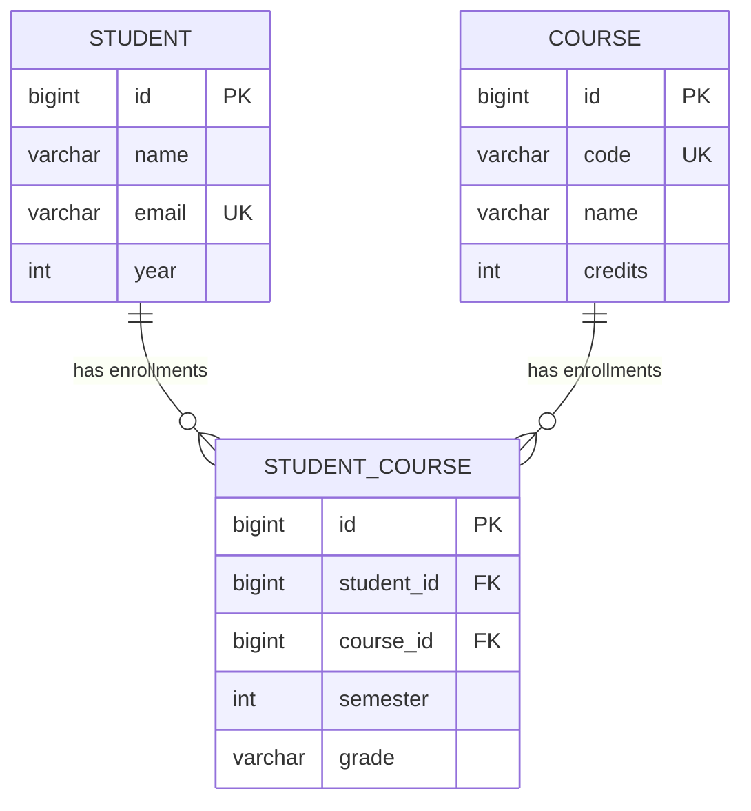

# Entity Relationships: Student ↔ Course

This document explains how the Students API models the relationship between **students** and **courses**, and why we designed it the way we did.

## 1. The Problem

- One **student** can take **many courses**.
- One **course** can have **many students**.

This is a **many-to-many (M:N)** relationship:

```
Student *  ────────────  * Course
        "enrolls in"
```

Relational databases **cannot store a many-to-many relationship directly** — a foreign key column can only point to *one* row. So where would we put the foreign key?

- On `students`? A student could then only have **one** course. ❌
- On `courses`? A course could then only have **one** student. ❌

## 2. The Solution: Break It with a Join Table

Every many-to-many is broken into **two one-to-many** relationships through a third table, called a **join table** (or *bridge* / *junction* table). In our project this table is `student_courses`, mapped by the `StudentCourse` entity:

```
Student 1 ────< StudentCourse >──── 1 Course
        (one student has many        (one course has many
         enrollments)                 enrollments)
```

As an ER diagram (Mermaid):



Each **row** in `student_courses` means: *"this student is enrolled in this course."*

### Example data

**students**

| id | name       | email                  | year |
|----|------------|------------------------|------|
| 1  | Amina Juma | amina.juma@suza.ac.tz  | 2    |
| 2  | Omar Ali   | omar.ali@suza.ac.tz    | 1    |

**courses**

| id | code  | name                        | credits |
|----|-------|-----------------------------|---------|
| 1  | CS101 | Introduction to Programming | 10      |
| 2  | WT201 | Web Technologies            | 12      |

**student_courses** (the join table)

| id | student_id | course_id | semester | grade |
|----|------------|-----------|----------|-------|
| 1  | 1          | 1         | 1        | A     |
| 2  | 1          | 2         | 2        | null  |
| 3  | 2          | 1         | 1        | null  |

Reading it: Amina takes CS101 and WT201; Omar takes CS101; CS101 has two students.

## 3. Why a Join *Entity* and Not Just `@ManyToMany`?

JPA does offer a `@ManyToMany` annotation that creates a hidden join table for you. We deliberately **did not** use it. Instead we made the join table a full entity (`StudentCourse`) with two `@ManyToOne` relationships. Reasons:

1. **The relationship itself has data.** *When* did the student enroll? *Which semester?* *What grade?* With `@ManyToMany`, the join table can only hold the two foreign keys — there is nowhere to put `semester` or `grade`. With a join entity, these are just normal columns.
2. **You can query and manage it directly.** An enrollment has its own `id`, its own REST endpoints (`/api/v1/enrollments`), its own repository. Enrolling, grading, and unenrolling are explicit operations instead of manipulating a hidden collection.
3. **It matches the real world.** "Enrollment" is a real concept the university tracks — it deserves to be a first-class object.

> **Rule of thumb:** start with a join entity whenever the relationship carries *any* extra information. Plain `@ManyToMany` only suits pure link tables (e.g. movie ↔ genre tags).

## 4. How It Looks in the Code

### The join entity — [StudentCourse.java](src/main/java/tz/ac/suza/wt/studentsapi/model/StudentCourse.java)

```java
@Entity
@Data
@Table(name = "student_courses",
       uniqueConstraints = @UniqueConstraint(columnNames = { "student_id", "course_id" }))
public class StudentCourse {
    @Id
    @GeneratedValue(strategy = GenerationType.IDENTITY)
    private Long id;

    @ManyToOne(fetch = FetchType.EAGER, optional = false)
    @JoinColumn(name = "student_id", nullable = false)
    private Student student;              // many enrollments -> one student

    @ManyToOne(fetch = FetchType.EAGER, optional = false)
    @JoinColumn(name = "course_id", nullable = false)
    private Course course;                // many enrollments -> one course

    @Column(nullable = false)
    private Integer semester;             // extra data ON the relationship

    @Column(length = 5)
    private String grade;                 // extra data ON the relationship
}
```

Key annotations:

| Annotation | What it does |
|---|---|
| `@ManyToOne` | Many `StudentCourse` rows point to one `Student` (or `Course`) — this is one half of the broken-up M:N |
| `@JoinColumn(name = "student_id")` | Names the foreign key column in the `student_courses` table |
| `@UniqueConstraint(columnNames = {"student_id", "course_id"})` | The same student cannot enroll in the same course twice |
| `optional = false` / `nullable = false` | An enrollment must always have both a student and a course |

Note that `Student` and `Course` contain **no reference back** to `StudentCourse`. The relationship is owned entirely by the join entity. This keeps the JSON clean (no infinite recursion) and keeps the example simple — a bidirectional `@OneToMany` list could be added later, but it isn't required.

### The generated SQL (what Hibernate creates)

```sql
CREATE TABLE student_courses (
    id         BIGSERIAL PRIMARY KEY,
    student_id BIGINT  NOT NULL REFERENCES students (id),
    course_id  BIGINT  NOT NULL REFERENCES courses (id),
    semester   INTEGER NOT NULL,
    grade      VARCHAR(5),
    UNIQUE (student_id, course_id)
);
```

### Creating an enrollment — [StudentCourseServices.java](src/main/java/tz/ac/suza/wt/studentsapi/services/StudentCourseServices.java)

The client sends only IDs (`{"studentId": 1, "courseId": 1, "semester": 1}`); the service looks up both sides, checks the business rules, and links them:

```java
public StudentCourse enroll(EnrollmentRequest request) {
    Student student = studentRepository.findById(request.studentId())
            .orElseThrow(() -> new RuntimeException("Student not found ..."));
    Course course = courseRepository.findById(request.courseId())
            .orElseThrow(() -> new RuntimeException("Course not found ..."));
    if (studentCourseRepository.existsByStudentIdAndCourseId(
            request.studentId(), request.courseId())) {
        throw new RuntimeException("Student ... is already enrolled ...");
    }
    StudentCourse enrollment = new StudentCourse();
    enrollment.setStudent(student);
    enrollment.setCourse(course);
    enrollment.setSemester(request.semester());
    return studentCourseRepository.save(enrollment);
}
```

### Navigating the relationship — [StudentCourseRepository.java](src/main/java/tz/ac/suza/wt/studentsapi/repository/StudentCourseRepository.java)

Spring Data derives the SQL joins from the method names:

```java
List<StudentCourse> findByStudentId(Long studentId);  // all courses of a student
List<StudentCourse> findByCourseId(Long courseId);    // all students in a course
boolean existsByStudentIdAndCourseId(Long studentId, Long courseId);
```

## 5. Trying It Over REST

```bash
# 1. Create a student and a course
curl -X POST http://localhost:8090/api/v1/students \
  -H "Content-Type: application/json" \
  -d '{"name":"Amina Juma","email":"amina.juma@suza.ac.tz","year":2}'

curl -X POST http://localhost:8090/api/v1/courses \
  -H "Content-Type: application/json" \
  -d '{"code":"CS101","name":"Introduction to Programming","credits":10}'

# 2. Link them: enroll student 1 in course 1
curl -X POST http://localhost:8090/api/v1/enrollments \
  -H "Content-Type: application/json" \
  -d '{"studentId":1,"courseId":1,"semester":1}'

# 3. Navigate the relationship in both directions
curl http://localhost:8090/api/v1/enrollments/student/1   # Amina's courses
curl http://localhost:8090/api/v1/enrollments/course/1    # CS101's students

# 4. Put data ON the relationship: assign a grade
curl -X PUT http://localhost:8090/api/v1/enrollments/1 \
  -H "Content-Type: application/json" \
  -d '{"semester":1,"grade":"A"}'

# 5. Run it twice — the duplicate enrollment is rejected
curl -X POST http://localhost:8090/api/v1/enrollments \
  -H "Content-Type: application/json" \
  -d '{"studentId":1,"courseId":1,"semester":1}'
```

## 6. Key Takeaways

1. A **many-to-many** relationship can never be stored directly — it is always broken into **two one-to-many** relationships through a **join table**.
2. Make the join table a **real entity** (`StudentCourse`) whenever the relationship carries its own data (`semester`, `grade`).
3. The join entity holds two `@ManyToOne` sides; the foreign keys live in the join table, never in `students` or `courses`.
4. A **unique constraint** on `(student_id, course_id)` enforces "enroll once" at the database level — the service also checks it to return a friendly error.
5. Clients exchange **IDs** (via `EnrollmentRequest`), and the service resolves them to entities — the JSON API never needs nested object graphs to create a link.
